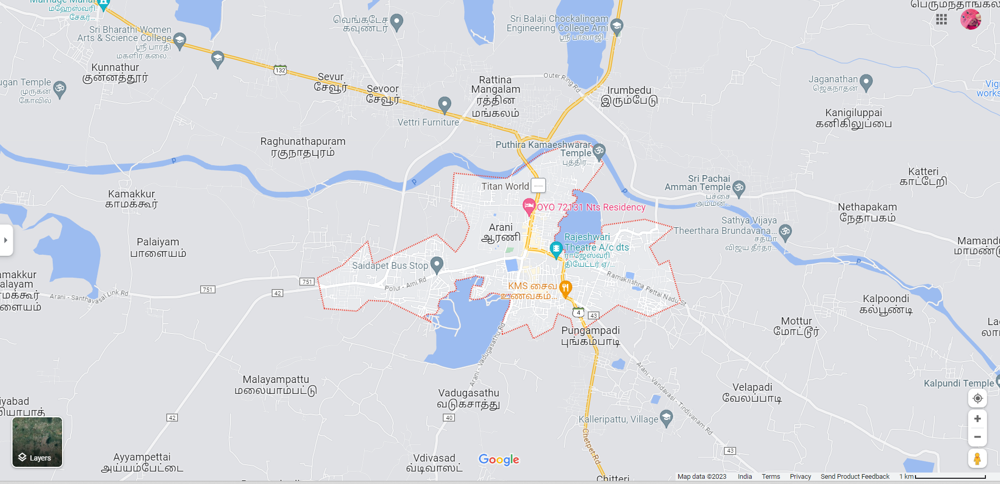
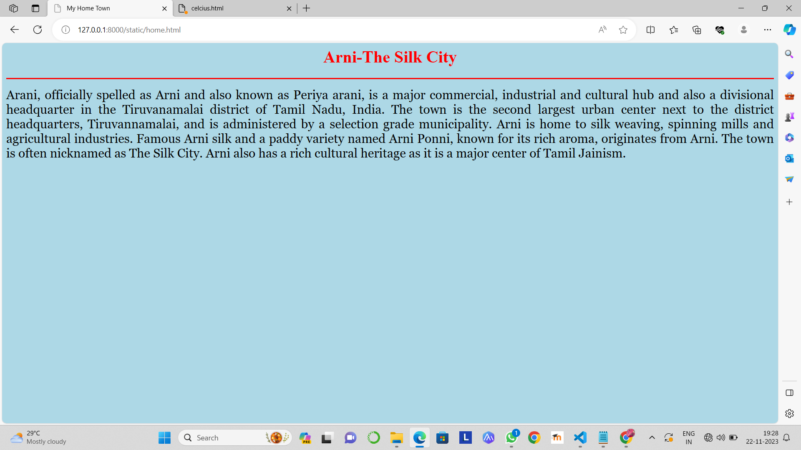
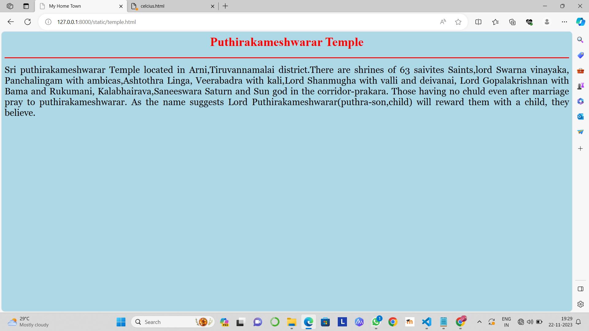
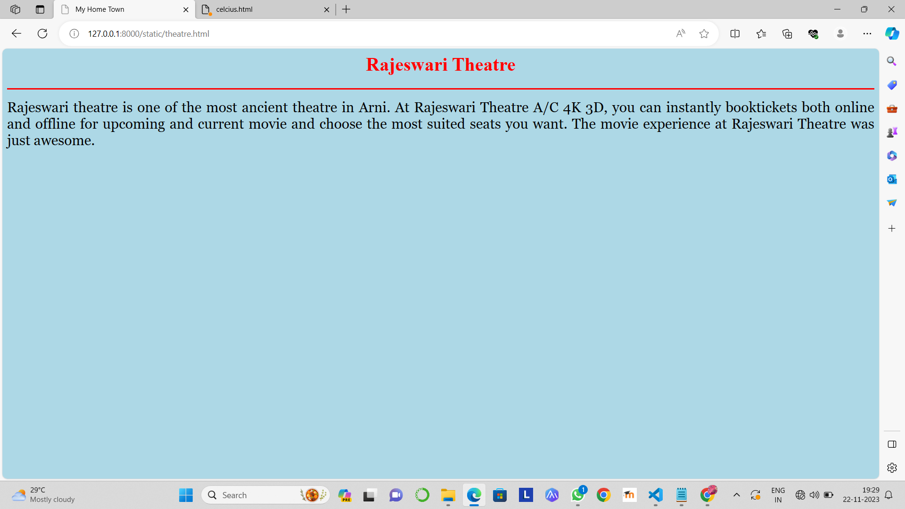
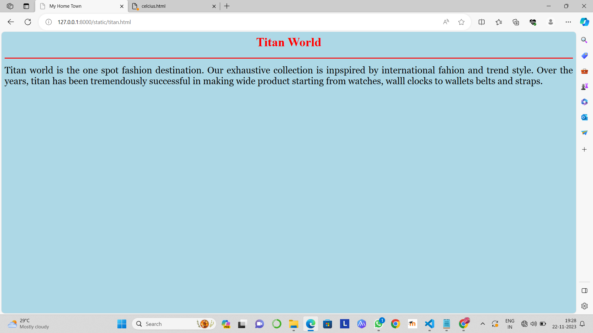

# Ex04 Places Around Me
## Date: 22/11/2023
## AIM
To develop a website to display details about the places around my house.

## DESIGN STEPS

### STEP 1
Create a Django admin interface.

### STEP 2
Download your city map from Google.

### STEP 3
Using ```<map>``` tag name the map.

### STEP 4
Create clickable regions in the image using ```<area>``` tag.

### STEP 5
Write HTML programs for all the regions identified.

### STEP 6
Execute the programs and publish them.

## CODE

map.html
<html>
<head>
<title>My Hometown</title>
</head>
<body>
<h1 align="center">
<font color="red"><b>Arni-The Silk City</b></font>
</h1>
<h3 align="center">
<font color="blue"><b> Zafreen J (23012754)</b></font>
</h3>
<center>

<map name="MyCity">
<area shape="rect" coords="700,250,750,300" href="home.html" title="My Home Town">
<area shape="rect" coords="710,170,880,200" href="temple.html" title="Puthira Kameshwar Temple">
<area shape="rect" coords="790,290,900,340" href="theatre.html" title="Rajeshwari Theatre">
<area shape="rect" coords="500,320,650,350" href="IFB.html" title="Bus stand">
<area shape="rect" coords="690,200,800,250" href="titan.html" title="Titan World">
</map>
</center>
</body>
</html>


home.html

<html>
<head>
<title>My Home Town</title>
</head>
<body bgcolor="lightblue">
<h1 align="center">
<font color="red"><b>Arni-The Silk City</b></font>
</h1>
<hr size="3" color="red">
<p align="justify">
<font face="Georgia" size="5">
    Arani, officially spelled as Arni and also known as Periya arani, is a major commercial, industrial and cultural hub and also a
divisional headquarter in the Tiruvanamalai district of Tamil Nadu, India. The town is the second largest urban center next to the 
district headquarters, Tiruvannamalai, and is administered by a selection grade municipality. Arni is home to silk weaving, 
spinning mills and agricultural industries. Famous Arni silk and a paddy variety named Arni Ponni, known for its rich aroma, originates
from Arni. The town is often nicknamed as The Silk City. Arni also has a rich cultural heritage as it is a major 
center of Tamil Jainism.
</p>
</body>
</html>

temple.html

<html>
<head>
<title>My Home Town</title>
</head>
<body bgcolor="lightblue">
<h1 align="center">
<font color="red"><b>Puthirakameshwarar Temple</b></font>
</h1>
<hr size="3" color="red">
<p align="justify">
<font face="Georgia" size="5">
    Sri puthirakameshwarar Temple located in Arni,Tiruvannamalai district.There are shrines of 63 saivites Saints,lord Swarna 
vinayaka, Panchalingam with ambicas,Ashtothra Linga, Veerabadra with kali,Lord Shanmugha with valli and deivanai, Lord
Gopalakrishnan with Bama and Rukumani, Kalabhairava,Saneeswara Saturn and Sun god in the corridor-prakara.  
    Those having no chuld even after marriage pray to puthirakameshwarar. As the name suggests Lord Puthirakameshwarar(puthra-son,child)
will reward them with a child, they believe.
</p>
</body>
</html>

theatre.html

<html>
<head>
<title>My Home Town</title>
</head>
<body bgcolor="lightblue">
<h1 align="center">
<font color="red"><b>Rajeswari Theatre</b></font>
</h1>
<hr size="3" color="red">
<p align="justify">
<font face="Georgia" size="5">
    Rajeswari theatre is one of the most ancient theatre in Arni. At Rajeswari Theatre A/C 4K 3D, you can instantly booktickets both online
and offline for upcoming and current movie and choose the most suited seats you want. The movie experience at Rajeswari Theatre
was just awesome.
</p>
</body>
</html>

IFB.html

<html>
<head>
<title>My Home Town</title>
</head>
<body bgcolor="lightblue">
<h1 align="center">
<font color="red"><b>IFB Point</b></font>
</h1>
<hr size="3" color="red">
<p align="justify">
<font face="Georgia" size="5">
    IFB Home Appliances is an Indian home appliances company and a division of IfB industries. It has its manufacturing locations
in kolkata and verna, Goa. The company has a chain of 530 retail outlets called 'IFB Point'. Originally IFB industries was known
as Indian Fine Blanks Ltd and started operations in India in 1974 in collaboration with Heinrich Schmid AG of switzerland. In 1989
it entered an agreement with Bosch-Siemens Hausgerate to prodce fully-automatic washing machines and other domestic appliances. The 
home appliances division started in 1990-91. The factory is based at Verna Industrial estate, Verna, Goa, India and Viswesriah 
Industrial Estate.
</p>
</body>
</html>

titan.html

<html>
<head>
<title>My Home Town</title>
</head>
<body bgcolor="lightblue">
<h1 align="center">
<font color="red"><b>Titan World</b></font>
</h1>
<hr size="3" color="red">
<p align="justify">
<font face="Georgia" size="5">
        Titan world is the one spot fashion destination. Our exhaustive collection is inpspired by international fahion and trend style.
Over the years, titan has been tremendously successful in making wide product starting from watches, walll clocks to wallets
belts and straps.
</p>
</body>
</html>


## OUTPUT









## RESULT
The program for implementing image maps using HTML is executed successfully.
